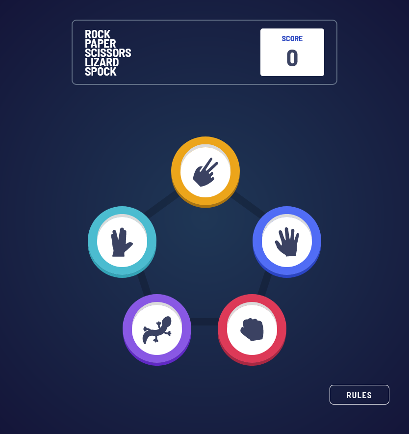

# Frontend Mentor - Rock, Paper, Scissors solution

This is a solution to the [Rock, Paper, Scissors challenge on Frontend Mentor](https://www.frontendmentor.io/challenges/rock-paper-scissors-game-pTgwgvgH). Frontend Mentor challenges help you improve your coding skills by building realistic projects.

## Table of contents

- [Overview](#overview)
  - [The challenge](#the-challenge)
  - [Screenshot](#screenshot)
  - [Links](#links)
- [My process](#my-process)
  - [Built with](#built-with)
  - [What I learned](#what-i-learned)
  - [Continued development](#continued-development)
  - [Useful resources](#useful-resources)
- [Author](#author)

## Overview

### The challenge

Users should be able to:

- View the optimal layout for the game depending on their device's screen size
- Play Rock, Paper, Scissors against the computer
- Maintain the state of the score after refreshing the browser _(optional)_
- **Bonus**: Play Rock, Paper, Scissors, Lizard, Spock against the computer _(optional)_

### Screenshot

### Links

- Solution URL: [https://github.com/jeansy42/rock-paper-scissors-master-game](https://github.com/jeansy42/Multi-step-Form)
- Live Site URL: [https://jeansy42.github.io/rock-paper-scissors-master-game/](https://jeansy42.github.io/rock-paper-scissors-master-game/)

## My process

### Built with

- Semantic HTML5 markup
- CSS custom properties
- Flexbox
- [React](https://reactjs.org/) - JS library
- [Sass](https://sass-lang.com/) - CSS preprocessor

### What I learned

The development of this project has been very important. In its implementation, I used the CSS preprocessor Sass for the first time, which made me feel very good as it organizes and modularizes the work better. In my opinion, it helped me a lot in acquiring new skills in website design, animations, and interactions among different elements of the site. Once again, I worked with React and further consolidated my skills with it. Honestly, I feel proud of the work.

### Continued development

I intend to continue developing my skills in JavaScript and React through the creation of more complex projects, making my knowledge increasingly useful, and ultimately securing my first job as a programmer.

### Useful resources

- [ChatGPT](https://chat.openai.com/) - My right hand, always clarifying doubts and making development more viable.

## Author

- Frontend Mentor - [@jeansy42](https://www.frontendmentor.io/profile/jeansy42)
- Twitter - [@jeansy42](https://www.twitter.com/jeansy42)
